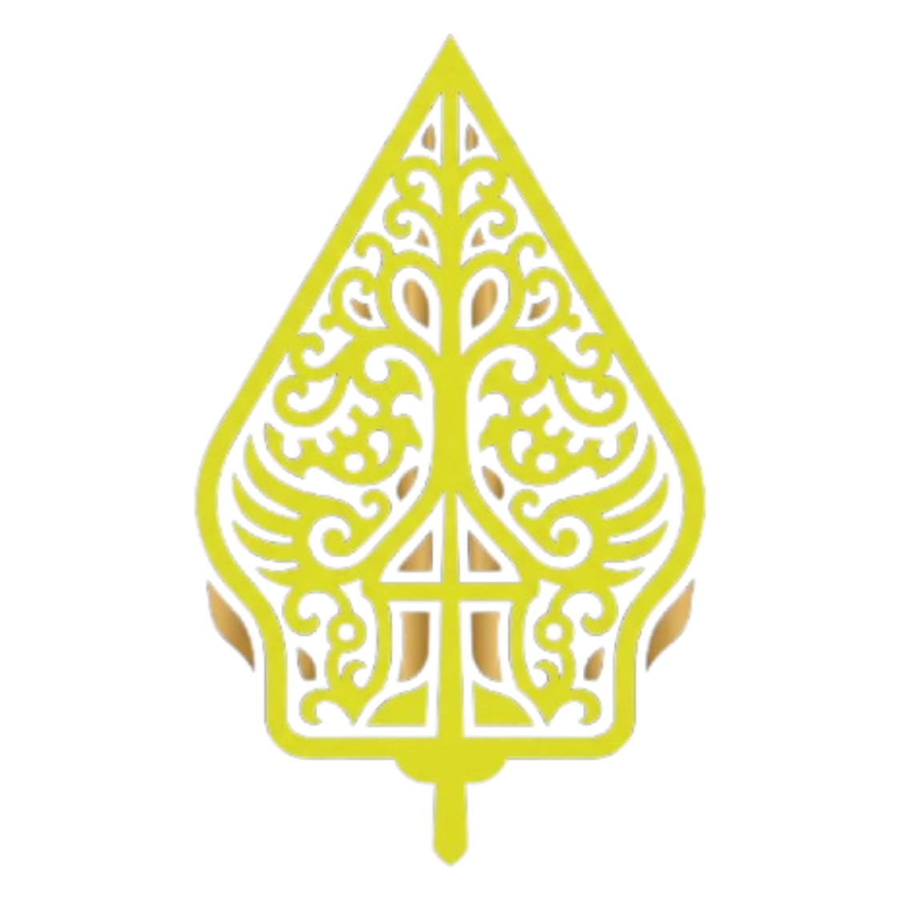

<div align="center">

  

  # 🎭 WAYANG JAWI
  ### Panggung Wayang Kulit Digital Interaktif, Studio Lakon Sastra, & Ensiklopedia Budaya Berbasis AI

  **Karya Inovasi Teknologi Kebudayaan — Tema: *LUMINE* (Illuminating Indonesian Heritage through Interactive Technology)**

  [](https://nextjs.org/)
  [](https://react.dev/)
  [](https://www.typescriptlang.org/)
  [](https://tailwindcss.com/)
  [](https://developers.google.com/mediapipe)
  [](https://threejs.org/)
  [](https://greensock.com/)
  [](https://www.remotion.dev/)
  [](LICENSE)

  <p align="center">
    <em>"Menghidupkan seni wayang kulit lewat panggung digital interaktif, pelacakan gestur dalang AI berbasis kamera, eksplorasi 3D adiluhung, dan dialog kreasi sastra pewayangan nusantara."</em>
  </p>

</div>

---

## 📖 1. Latar Belakang & Kesesuaian Tema (*LUMINE*)

Seni pertunjukan **Wayang Kulit** telah diakui oleh UNESCO sebagai *Masterpiece of the Oral and Intangible Heritage of Humanity* sejak tahun 2003 (inskripsi 2008). Namun, di era digital kontemporer, kesenian adiluhung ini menghadapi tantangan pelestarian nyata di kalangan generasi muda:
- **Keterbatasan Akses Instrumen Fisik**: Biaya dan kelangkaan wayang kulit tatah sungging asli, kelir kain mori, blencong tembaga, dan gamelan perunggu.
- **Kompleksitas Teknik Pedalangan**: Keterampilan motorik memanipulasi *cempurit* dan *tuding* menuntut latihan intensif bertahun-tahun di sanggar pedalangan tradisi.
- **Kesenjangan Bahasa & Media Narasi**: Bahasa sastra pakeliran klasik sering kali berjarak dengan preferensi komunikasi interaktif generasi digital.

### 🌟 Solusi Inovatif: *Wayang Jawi*
Menjawab tema kompetisi **LUMINE** (*menyinari dan menerangi khazanah bangsa lewat teknologi*), **Wayang Jawi** hadir mentransformasikan peramban web menjadi panggung kelir virtual interaktif yang inklusif, modern, dan edukatif:
1. **Menyinari Warisan (*Cultural Illumination*)**: Menghadirkan kembali filosofi karakter Pandawa & Punakawan, lakon spiritual agung (*Bima Suci*), serta direktori 16 gedung museum wayang nusantara dalam balutan desain editorial kelas dunia.
2. **Kecerdasan Buatan Tanpa Hambatan (*Zero-Hardware AI Vision*)**: Cukup menggunakan kamera laptop atau ponsel biasa, siapapun dapat langsung menjadi dalang secara real-time menggerakkan dua tokoh wayang sekaligus dengan gestur tangan alami.
3. **Pustaka Lakon & Glosarium Terbuka**: Menyediakan naskah wiracarita lengkap dengan kidung macapat, audio gamelan slendro-pelog, serta penjelajah istilah glosarium instan.

---

## ✨ 2. Peta Fitur Lengkap Platform (*Platform Feature Matrix*)

### 🕹️ 1. Panggung Virtual Dalang AI (`/stage`)
- **Dual-Hand Computer Vision Tracking**: Memanfaatkan model `@mediapipe/tasks-vision` untuk melacak 21 titik sendi tangan kiri dan kanan secara simultan pada 60 FPS langsung di sisi klien (*client-side*).
- **Kinematika Skeletal Hierarkis (*Rigging Engine*)**:
  - *Telapak Tangan*: Mengatur pergeseran posisi dan ketinggian tubuh wayang (*cempurit/gapit*).
  - *Ibu Jari & Telunjuk*: Menggerakkan sendi siku dan lengan wayang (*tuding*).
  - *Kemiringan Tangan (Pitch/Roll)*: Mengatur sudut kemiringan dan dinamika gestur sabetan wayang.
  - *Z-Depth Estimation*: Menyesuaikan skala bayangan wayang pada kain kelir seperti mendekatkan wayang ke lampu blencong fisik.
  - *Jari Kelingking*: Memicu gestur tarian wayang khas (*Kiprahan*).
- **Dukungan 6 Tokoh Panggung**: Raden Arjuna, Sang Gatotkaca, Kyai Semar, Kyai Petruk, Kyai Bagong, dan Raden Werkudara.
- **Synthesizer Gamelan Web Audio API**: Audio tabuhan gamelan slendro dinamis dan tata cahaya api blencong yang bernapas mengikuti gerakan tokoh.
- **Fallback Mouse & Touch Control**: Dilengkapi mode simulasi sentuhan jemari dan tetikus otomatis untuk perangkat tanpa webcam.

### 🎭 2. Katalog Tokoh Pewayangan Nusantara (`/katalog` & `/tokoh/[slug]`)
- **Koleksi 9 Tokoh Utama**: Kyai Semar, Kyai Petruk, Kyai Bagong, Nala Gareng, Sang Arjuna, Sang Bima, Sang Gatotkaca, Prabu Rahwana, dan Resi Drona.
- **Filter Kategori Cepat**: Navigasi multi-kategori (`Semua Tokoh`, `Punakawan`, `Pandawa Lima`, dan `Tokoh Kerajaan`).
- **Mesin Pencari Instan & Chip Tag**: Pencarian berbasis nama, peran, pusaka, dan watak filosofis dengan chip populer (`#Semar`, `#Arjuna`, `#Gatotkaca`, `#Bima`, dll.).
- **Halaman Eksplorasi Mendalam (`/tokoh/[slug]`)**:
  - Banner visual 16:9 beresolusi tinggi dengan lencana watak kuratorial.
  - Aksara Jawa Hanacaraka Unicode resmi.
  - Narasi asal-usul & silsilah wiracarita.
  - Simbolisme filosofis & ajaran moral luhur.
  - Daftar pusaka sakti lengkap dengan ikonografi tematik.
  - Desain *follow-along* yang mengalir natural saat halaman digulir.

### 📚 3. Pustaka Lakon & Pembaca Cerita Interaktif (`/kreasi` & `/story`)
- **Katalog 15 Lakon Wiracarita Klasik**: *Dewa Ruci (Bima Suci)*, *Bharatayudha*, *Wisanggeni Gugat*, *Anoman Obong*, *Karna Tandhing*, *Gatotkaca Gugur*, *Petruk Dadi Ratu*, dll.
- **Pembaca Lakon Teatrikal (*StoryReader*)**:
  - **Audio Narasi Pedalangan**: Pemutar suara naratif terintegrasi dengan tombol pengatur kecepatan suara (`0.75x`, `1.0x`, `1.25x`), penanda babak, dan tombol bisu.
  - **Efek Partikel Blencong (*FloatingEmbersOverlay*)**: Partikel bara api keemasan melayang lembut di atas naskah.
  - **Babak Pedalangan Zig-Zag**: Pembagian babak cerita dengan transisi visual kanvas teatrikal.
  - **Dialog Lakon & Drop Cap Klasik**: Format tipografi bernuansa naskah keraton dengan kutipan berbingkai emas.
  - **Glosarium Interaktif Pedalangan (*GlossaryTooltip*)**: Kata kunci budaya (*Pancanaka*, *Blencong*, *Kelir*, *Cempala*, *Gandiwa*, *Suluk*, dll.) disorot dengan garis emas dan menampilkan pop-up penjelasan etimologi tanpa memicu hydration error.
- **Sobekan Tirai Interaktif (*Tiger Tear Reveal*)**: Komposisi poster pembuka yang terbelah dua saat digulir, memperlihatkan kanvas 3D kepala Rahwana di baliknya.

### 🏛️ 4. Beranda Teatrikal & Galeri Virtual (`/`)
- **Hero Video Teatrikal**: Cuplikan video gerak dalang beresolusi tinggi dengan tombol aksi langsung ke panggung kelir.
- **Marquee Ticker Tape Berjalan**: Pita teks dwibahasa pewayangan yang responsif terhadap kecepatan gulir (*scroll-dependent velocity*).
- **Pentas Lakon Bima Suci (`#lakon`)**: Pemutar video pementasan kolosal berbingkai kanvas emas teatrikal.
- **Roda Karakter 3D (*WorksWheel Tokoh*) (`#cara-bermain`)**: Silinder drum 3D putar interaktif untuk mengenalkan watak ksatria, beradaptasi mulus di perangkat seluler.
- **Galeri Museum Wayang Indonesia (`#galeri`)**: Pameran 3D interaktif (*Formation Carousel*) berisi 16 gedung museum wayang asli se-Indonesia lengkap dengan modal detail profil museum dan sejarah bangunannya.
- **Pustaka Tanya Jawab Budaya (`#faq`)**: Tab tanya-jawab interaktif seputar panggung digital, kecerdasan buatan, dan kebudayaan.
- **Kanvas Model 3D Petruk (`#join`)**: Model 3D interaktif Kyai Petruk berbasis Three.js WebGL yang dapat diputar 360 derajat oleh pengunjung.

### 📰 5. Warta Budaya & Liputan UNESCO (`/berita`)
- **Sorotan Artikel Utama**: Liputan mendalam penetapan Wayang Kulit oleh UNESCO ICH.
- **Daftar Berita Editorial Terkurasi**: Dokumentasi warta dari Kompas.com, CNN Indonesia, Detikcom, Antara News, dan Tempo mengenai kiprah maestro dalang (Ki Manteb Soedarsono, Ki Seno Nugroho, Ki Anom Suroto) serta festival pewayangan.

### 📜 6. Panduan & Tutorial Mendalang (`/panduan` & `/tutorial`)
- **Panduan Gestur Kamera**: Diagram visual 4 gestur tangan utama (*Poros Gapit*, *Gerak Lengan Tuding*, *Tarian Kiprahan*, dan *Kedalaman Bayangan Z-Depth*).
- **Tab Pemilihan Perangkat**: Panduan khusus untuk pengguna ponsel cerdas (*Mobile*) dan komputer/laptop (*Desktop*).

### 👥 7. Kredit, Profil Pengembang, & Ekosistem Mitra (`/kredit`)
- **Panggung Interaktif Tiga Siswa SMK Telkom Malang**:
  - Penataan posisi proporsional ketiga kreator sesuai pose dokumentasi kelompok asli.
  - Efek bayangan siluet murni (*alpha-traced silhouette shadow*) yang mengikuti kontur fisik tubuh masing-masing orang.
  - Tombol magnetis dinamis (*dynamic cursor follower pill badge*) yang melayang mengikuti kursor pengguna.
  - Jendela pop-up modal detail profil dengan dudukan panggung emas (*exhibition pedestal plinth*) dan tombol sosial media resmi (GitHub, LinkedIn, Instagram).
- **Marquee Ekosistem & Jejaring Mitra (*Logo Cloud Infinite Slider*)**:
  - Menampilkan logo resmi institusi dan teknologi pendukung: UNESCO ICH, SENAWANGI, Kemendikbudristek RI, SMK Telkom Malang Moklet, Next.js 16, Google MediaPipe, Tailwind CSS, Three.js, GSAP Motion, Framer Motion, Lucide Icons, dan GitHub.
- **Katalog Rujukan Ilmiah Interaktif (*SuperHoverList*)**:
  - Daftar arsip sumber rujukan dengan kartu pratinjau melayang berkilau emas saat disorot kursor (*floating artwork preview*).

### 🎬 8. Video Motion Graphics Terprogram (`remotion/`)
- Komposisi video motion graphics berbasis React (`remotion/DalangShowcase.tsx`) yang dapat di-preview langsung melalui Remotion Studio dan di-render menjadi file video MP4 berkualitas siaran.

---

## 🏗️ 3. Arsitektur Teknis & Struktur Folder (*Clean Architecture*)

Proyek ini menerapkan **Clean Architecture & Modular Domain Structure** untuk memisahkan secara tegas antara modul antarmuka, kontrol animasi, kanvas 3D, logika panggung, dan rute navigasi:

```text
dalang-style/
├── app/                              # Next.js 16 App Router Directory
│   ├── (marketing)/                  # Marketing & Editorial Route Group
│   │   ├── layout.tsx                # Marketing Layout dengan Navbar & SiteFrame
│   │   ├── page.tsx                  # Beranda Utama (Hero, Lakon, Carousel, FAQ, dll.)
│   │   ├── kreasi/page.tsx           # Pustaka Lakon & Pembaca Cerita Wayang
│   │   ├── story/page.tsx            # Alias Rute Story
│   │   ├── katalog/page.tsx          # Katalog Tokoh Pewayangan
│   │   ├── tokoh/[slug]/page.tsx     # Halaman Eksplorasi Detail Tokoh Wayang
│   │   ├── berita/page.tsx           # Warta & Catatan Kebudayaan
│   │   ├── panduan/page.tsx          # Panduan Gestur & Pengendalian Dalang
│   │   ├── tutorial/page.tsx         # Alias Tutorial
│   │   └── kredit/page.tsx           # Profil Tim Pengembang & Ekosistem Mitra
│   ├── (stage)/                      # Panggung Virtual Fullscreen Route Group
│   │   ├── layout.tsx                # Shell Layout Panggung Gelap
│   │   └── stage/page.tsx            # Panggung Interaktif Dalang AI
│   ├── globals.css                   # Tailwind CSS v4 Global Styling
│   ├── wayang.css                    # Keyframe Pencahayaan & Kanvas Panggung
│   └── layout.tsx                    # Root Layout dengan Font & Viewport Definition
├── components/                       # Clean Modular Component Architecture
│   ├── ui/                           # Primitif UI & Desain Interaktif Reusable
│   │   ├── infinite-slider.tsx       # Mesin Marquee Loop Berkelanjutan
│   │   ├── logo-cloud.tsx            # Marquee Logo Resmi Ekosistem Mitra
│   │   ├── super-hover-list.tsx      # Daftar Arsip dengan Pratinjau Gambar Melayang
│   │   ├── works-wheel.tsx           # Silinder Putar Tokoh 3D
│   │   ├── tiger-tear-reveal.tsx     # Efek Sobekan Tirai Interaktif Rahwana 3D
│   │   ├── stack-spread.tsx          # Pustaka Lakon Kinetic Scroll Fan-In
│   │   ├── formation.tsx             # Galeri Museum 3D Carousel
│   │   ├── flip-card.tsx             # Kartu Teatrikal Sang Dalang 3D Flip
│   │   ├── origin-button.tsx         # Tombol Asal Usul Efek Ripple
│   │   ├── blur-text.tsx             # Animasi Teks Blur-In Kata per Kata
│   │   ├── faq-tabs.tsx              # Tab Pustaka Tanya Jawab
│   │   ├── navbar-menu.tsx           # Floating Dropdown Navigation
│   │   ├── staggered-menu.tsx        # Mobile Navigation Drawer Berjenjang
│   │   └── text-marquee.tsx          # Ticker Tape Dinamis
│   ├── sections/                     # 10 Seksi Terisolasi Halaman Beranda
│   │   ├── HeroWayangJawi.tsx        # Seksi 1: Video Hero Cinematic
│   │   ├── StoryShadowsSection.tsx   # Seksi 2: Panggung Teater Sang Dalang
│   │   ├── SectionBimaSuci.tsx       # Seksi 3: Pentas Video Lakon Bima Suci
│   │   ├── SectionStoryAwakening.tsx # Seksi 4: Galeri Tokoh Wayang
│   │   ├── SectionWayangGenerator.tsx# Seksi 5: Pustaka Kisah Sastra
│   │   ├── SectionStoryFinale.tsx    # Seksi 6: Liputan UNESCO & Warta
│   │   ├── SectionMovementMeaning.tsx# Seksi 7: Carousel Makna Gerak Wayang
│   │   ├── SectionGalleryMuseum.tsx  # Seksi 8: Galeri 16 Museum Wayang
│   │   ├── SectionFAQ.tsx            # Seksi 9: Pustaka Tanya Jawab Budaya
│   │   └── SectionJoinTheNight.tsx   # Seksi 10: Penutup & Model 3D Petruk
│   ├── canvas/                       # Kanvas WebGL Three.js 3D Terisolasi
│   │   ├── Petruk3DCanvas.tsx        # Render Model 3D Petruk GLTF
│   │   └── Rahwana3DFaceCanvas.tsx   # Render Model 3D Kepala Rahwana GLTF
│   ├── layout/                       # Komponen Shell & Navigasi Global
│   │   ├── Navbar.tsx                # Navigasi Pulau Mengambang & Notch Responsif
│   │   ├── SiteFrame.tsx             # Bingkai Garis Viewport Teatrikal
│   │   ├── SmoothScroll.tsx          # Inisialisasi Lenis Inertia Scrolling
│   │   └── WayangLogo.tsx            # Lambang Vektor Gunungan Emas
│   ├── animations/                   # Pengontrol Animasi GSAP & Efek Teks
│   │   ├── GsapAnimations.tsx        # GSAP ScrollTrigger Landing Page
│   │   ├── PanduanGsapAnimations.tsx # GSAP ScrollTrigger Halaman Panduan
│   │   ├── BeritaGsapAnimations.tsx  # GSAP ScrollTrigger Halaman Berita
│   │   ├── KatalogGsapAnimations.tsx # GSAP ScrollTrigger Halaman Katalog
│   │   ├── ScrollReveal.tsx          # Efek Teks Pudar Berantai
│   │   └── StrokeText.tsx            # Tipografi Garis Luar Tipis
│   ├── views/                        # View Halaman Khusus
│   │   ├── TeamInteractiveSection.tsx# Panggung Tiga Kreator & Dialog Profil
│   │   ├── KatalogTokohView.tsx      # Tampilan Katalog & Filter Tokoh
│   │   └── NewsEditorialView.tsx     # Tampilan Editorial Warta Budaya
│   ├── stage/                        # Panggung Dalang & Pelacakan AI
│   │   ├── WayangStage.tsx           # Kanvas 2D Fisika Boneka Wayang
│   │   └── GestureVisuals.tsx        # Diagram Panduan Gestur Tangan
│   ├── story/                        # Domain Modul Cerita Wayang
│   │   ├── StoryReader.tsx           # Antarmuka Pembaca Naskah Teatrikal
│   │   ├── StoryCatalog.tsx          # Katalog Kartu Lakon
│   │   ├── StoryCard.tsx             # Kartu Lakon Individual
│   │   ├── GlossaryTooltip.tsx       # Glosarium Istilah Pedalangan
│   │   ├── StoryGsapAnimations.tsx   # Animasi Babak Lakon
│   │   └── WayangVisualAssets.tsx    # Ornamen Pembatas Wayang
│   ├── mobile/                       # Modul Khusus Tampilan Ponsel
│   │   └── MobileTokohSection.tsx    # Penggeser Tokoh Sentuh Mobile
│   └── index.ts                      # Central Barrel Re-export
├── lib/                              # Basis Data, Mesin Pedalangan, & Utilitas
│   ├── wayang/                       # Mesin Simulasi Wayang Digital
│   │   ├── rig.ts                    # Hierarki Transformasi Sendi Boneka Wayang
│   │   ├── tracking.ts               # Pemetaan Titik Landmark MediaPipe ke Wayang
│   │   ├── render.ts                 # Double-Buffered Canvas 2D Pipeline 60 FPS
│   │   ├── audio.ts                  # Web Audio API Synthesizer Gamelan Slendro
│   │   ├── controller.ts             # Strategi Input Pengendalian (Kamera/Mouse)
│   │   ├── math.ts                   # Utilitas Vektor, Sudut, & Smoothing
│   │   └── dance.ts                  # Algoritma Koreografi Tarian Kiprahan
│   ├── wayang-stories.ts             # Basis Data Naskah Lakon Pewayangan
│   ├── tokoh-data.ts                 # Basis Data Karakter Tokoh & Pusaka
│   ├── news-data.ts                  # Basis Data Artikel & Warta Kebudayaan
│   └── utils.ts                      # Tailwind Merge & ClassName Helper
├── remotion/                         # Framework Video Animasi di React
│   ├── Root.tsx                      # Registrasi Komposisi Remotion
│   ├── DalangShowcase.tsx            # Storyboard Motion Graphics 30 Detik
│   └── scenes/                       # Adegan Video Terprogram
├── public/                           # Aset Statis Teroptimasi
│   ├── assets/                       # Tekstur Sendi Boneka Wayang (Dilindungi)
│   ├── images/                       # Aset Gambar WebP Terkompresi
│   ├── models/                       # Model 3D GLTF (Petruk & Rahwana)
│   └── videos/                       # Video Hero Dalang
├── next.config.ts                    # Konfigurasi Next.js 16 (Turbopack)
├── tsconfig.json                     # Konfigurasi Strict TypeScript Compiler
└── package.json                      # Dependensi & Skrip Proyek
```

---

## 🎨 4. Desain Sistem & Identitas Visual

| Elemen | Spesifikasi | Filosofi Budaya & Desain |
| :--- | :--- | :--- |
| **Warna Utama** | `Chartreuse Gold (#dedf42)` | Pendar api blencong modern, pencerahan intelektual, dan kesegaran tradisi di era digital. |
| **Warna Aksen** | `Prada Gold (#d9a441)` | Kemegahan tatah sungging prada keraton pewayangan klasik. |
| **Warna Dasar** | `Obsidian Black (#050303 - #0e0704)` | Keheningan malam pakeliran dan kontras bayangan kelir kain mori. |
| **Tipografi Judul** | `Playfair Display` & `Cormorant Garamond` | Anggun, berwibawa, dan bernuansa sastra keraton klasik nusantara. |
| **Tipografi Tubuh** | `Inter` | Jernih, terbaca sempurna di segala resolusi gawai modern. |
| **Aksara Daerah** | *Unicode Hanacaraka* | Penegas orisinalitas akar kebudayaan dan sastra Jawa. |

---

## 👥 5. Tim Pengembang (*Development Team*)

Dikembangkan oleh tiga siswa **SMK Telkom Malang (Moklet)**:

| Nama Pengembang | Peran & Disiplin | Fokus Kontribusi Utama |
| :--- | :--- | :--- |
| **Nabil Anwar K.** | `AI Architecture & Fullstack Engineering` | Perancangan arsitektur sistem, integrasi MediaPipe Vision AI, pipeline Next.js, dan optimasi performa. |
| **Styven Dwi N.** | `Creative Direction & Motion Design` | Desain tata panggung teatrikal, harmoni palet warna Jawa, tipografi sastra, dan animasi interaktif 3D. |
| **Risky Nabil P.** | `System Architecture & Cultural Research` | Keandalan sistem, tata kelola audio gamelan slendro-pelog, dan riset naskah wiracarita pewayangan. |

---

## 🚀 6. Panduan Instalasi & Menjalankan Lokal

### Prasyarat Sistem:
- **Node.js**: Versi `18.18.0` atau yang lebih baru (disarankan Node.js 20 LTS).
- **Package Manager**: `npm`, `pnpm`, atau `bun`.
- **Peramban Web Modern**: Google Chrome, Microsoft Edge, atau Safari dengan izin webcam untuk Panggung Virtual.

### Langkah Instalasi:

1. **Clone Repository GitHub**:
   ```bash
   git clone https://github.com/nabilkencana/dalang-style.git
   cd dalang-style
   ```

2. **Instal Dependensi**:
   ```bash
   npm install
   ```

3. **Jalankan Server Pengembangan (Dev Server)**:
   ```bash
   npm run dev
   ```
   Buka peramban di [http://localhost:3000](http://localhost:3000).

4. **Verifikasi Kualitas Kode (Clean Code Check)**:
   ```bash
   # Type check TypeScript (0 error)
   npx tsc --noEmit

   # Linting ESLint (0 error)
   npm run lint

   # Build Produksi (33 rute SSG/statis sukses teroptimasi)
   npm run build
   ```

5. **Pratinjau & Render Video Remotion (Opsional)**:
   ```bash
   # Membuka Remotion Studio interaktif
   npm run video:preview

   # Me-render video MP4 motion graphics
   npm run video:render
   ```

---

## 📱 7. Hasil Audit Responsivitas Seluruh Halaman (*100% Mobile Friendly*)

Platform telah melalui uji audit teknis peramban pada resolusi ponsel standar (**390×844 px**) dan resolusi kecil (**360×740 px**):

- ✅ **Bebas Horizontal Overflow**: `scrollWidth === clientWidth` pada seluruh 8 rute halaman utama (0 pixel *overflow* horizontal).
- ✅ **Navigasi Sentuh Adaptif**: Bilah navigasi mengambang beralih otomatis ke *Staggered Navigation Drawer* yang nyaman dijangkau jemari satu tangan.
- ✅ **Skala Tipografi Fluid**: Menggunakan fungsi CSS `clamp()` dan `@container` query sehingga judul besar tidak pernah terpotong di layar kecil.
- ✅ **Panggung Ramah Sentuhan**: Halaman `/stage` otomatis mengaktifkan mode sentuh kanvas (`touch-action: none`) bagi perangkat layar sentuh.

---

## 📄 8. Lisensi (*License*)

Proyek ini didistribusikan di bawah lisensi resmi **MIT License**. Kode sumber terbuka secara bebas untuk keperluan edukasi, pelestarian kebudayaan nusantara, penelitian, maupun pengembangan lebih lanjut. Lihat berkas [LICENSE](LICENSE) untuk ketentuan hukum lengkap.

---

<div align="center">
  <p>Dibuat dengan segenap dedikasi dan cinta untuk Kebudayaan Nusantara 🇮🇩</p>
  <p><strong>© 2026 Tim Pengembang Wayang Jawi • SMK Telkom Malang. Lisensi MIT.</strong></p>
</div>
